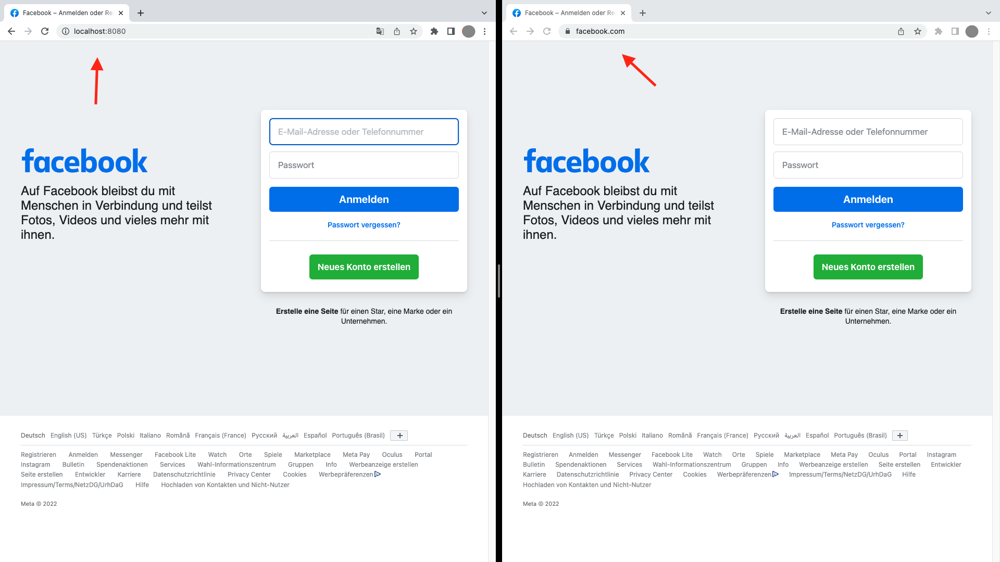

# phishing-site paperwork

In this assignment, the login screen of the social media giant Facebook, now Meta, is to be faked. First, this example requires downloading Visual Studio Code and installing PHP. Then, all that needs to be done is to create two files that will be tested in the localhost. An HTML file that contains the web page text and codes that define the output of the text in the browser. Simply put, this file defines how the user will perceive the web page. The second file contains a post method that defines what should happen once the potential victim has fallen for the phishing website.

After opening the Facebook home page in any browser, all you need to do is right-click in the window to go to, for example, Show Page Source or Inspect to view the HTML code there.

Now the code can be copied out, pasted into your own HTML file, saved and the localhost updated in the browser. Consequently, the design of the phishing website already corresponds to that of the originals.

If you take a closer look at the HMTL file, you will find a post method. A post method sends data (interesting here: username and password) to a server.

So Facebook's original intention was to send this data to its servers in a file so that it can authenticate this user. However, the attacker doesn't want to authenticate anything, he just wants to send the credentials to his server to steal them. To make this possible, the action attribute must be updated. This action attribute specifies where the form data, that is, the username and password, should be sent once the form is submitted. The form is submitted as soon as the user has clicked on the "Login" button. Additionally, the content of the ID attribute must be deleted, otherwise the username and password will be encrypted.

After saving again, an almost fully functional phishing website has now been created. The self-created post method ensures that after the login button is pressed, a text file is created (in this case in VS code) in which the login credentials are listed as specified. Moreover, the code sets up that the user is redirected to the original Facebook website immediately after the login attempt.

In practice, attackers legally buy domains on the Internet behind which there is a server on which they would place the files created here, for example (index.html and post.php). Consequently, the your-password.txt file would also open on the server, but only once. In case of multiple login attempts, the text file updates itself. For the sake of simplicity, there is the possibility to be notified by the server via e-mail about a successful phishing attack including the text file in the attachment.

